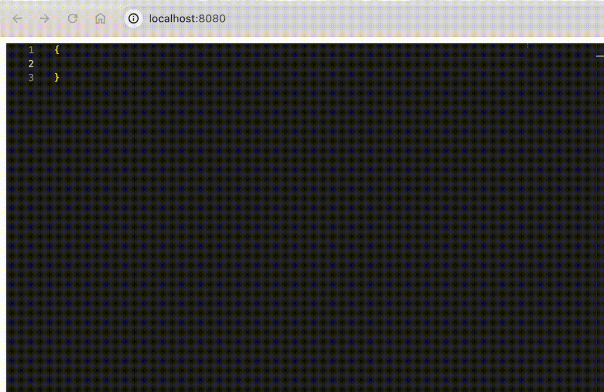

# Yet Another Json Editor

## Features

- Json key and value suggestions
- Auto complete nested object
- Use '@' character to reference a definition in json schema


## How to use

### Install

```bash
bun add yaje
```

### Example

see [example](./src/Example.tsx)

## Setup

Install the dependencies:

```bash
bun install
``` 

## Get Started

Start the dev server:

```bash
bun run dev
```

Build the app for production:

```bash
bun run build
```
